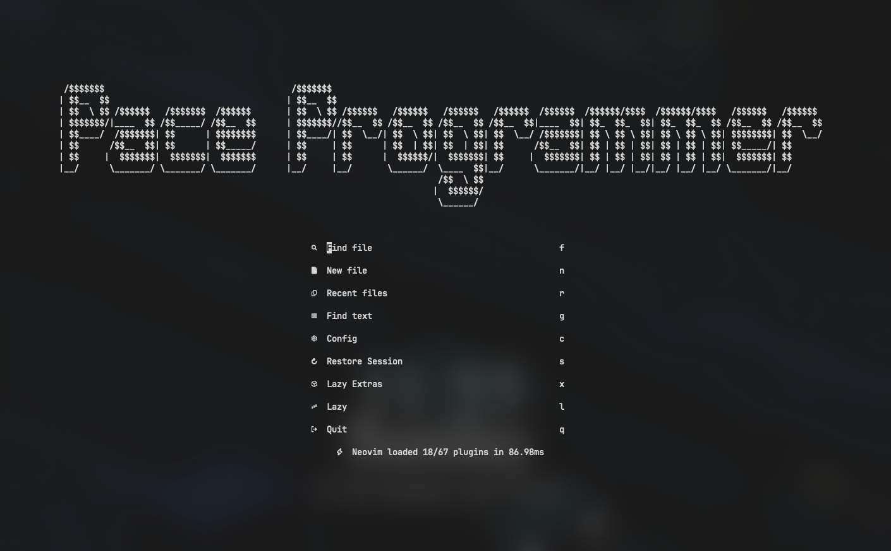

# LazyVim Configuration

This repository contains my customized configuration for [LazyVim](https://www.lazyvim.org/), a modular and highly extensible Neovim setup.



## Features

- **LSP Support**: Configured with `nvim-lspconfig` for language server support, including TailwindCSS.
- **Autocomplete**: Uses `nvim-cmp` with sources like LSP, buffer, and path.
- **Testing Support**: Integrated `neotest` with Jest and Vitest.
- **Terminal Integration**: `toggleterm.nvim` with `<Ctrl-;>` for toggling a floating terminal.
- **Git Integration**: Open LazyGit with `<Space> g g`.
- **Vim Keybindings in VSCode**: Custom keybindings for hover (`<S-k>`), scrolling, and other enhancements.

## Installation

1. Install Neovim (>= 0.9).
2. Clone this configuration into your Neovim config directory:

   ```sh
   git clone https://github.com/radirs/nvim ~/.config/nvim
   ```

3. Install LazyVim dependencies:

   ```sh
   nvim +Lazy sync +q
   ```

4. Restart Neovim and enjoy your customized experience.

## Keybindings

| Action                | Keybinding       |
|-----------------------|-----------------|
| Toggle Terminal       | `<Option-;>`      |
| Open LazyGit         | `<Space> g g`   |
| Show Hover           | `<S-k>`         |
| Save File            | `<Ctrl> s`     |
| Code Snapshot        | `<Space> c s`   |

## Customizations

### TailwindCSS LSP

Updated `tailwindCSS.experimental.classRegex` to support `tv()`, `cx()`, and `cva()` class detection.

### Autocomplete Path Restriction

Configured `nvim-cmp` to show file paths only within the current working directory.

### Testing

- `neotest-jest` and `neotest-vitest` added for running tests inside Neovim.
- Test adapters configured using LazyVim syntax.

## Troubleshooting

- **Autocomplete shows system paths:** Ensure that `cmp-path` is configured to limit suggestions to the working directory.
- **Keybindings not working in VSCode:** Check VSCode Vim extension settings and confirm keybinding overrides.

## Contributions

Feel free to fork and submit PRs to improve the configuration!

## License

MIT
